# NKU新闻搜索引擎项目说明
## 项目架构
项目整体围绕搜索引擎构建，涵盖网页抓取、索引构建、链接分析、搜索功能实现、个性化查询、Web界面搭建以及个性化推荐等多个核心模块，各模块协同工作，为用户提供高效的搜索服务。项目文件结构包含多个文件夹，如`index/`用于存储索引相关文件，`jsons`存放各类数据的JSON文件，`rank/`保存PageRank计算结果，`Search/`包含搜索功能代码，`spider/`存放爬虫代码，`Web/`用于Web界面相关文件。
```
SEARCH ENGINE/
├── index/
    ├── jsons
    	├── allTF_title.json
    	├── allTF.json
    	├── idf_title.json
    	├── idf.json
    	├── invert_index_title.json
    	├── ...
    ├── cut.ipynb
    ├── invertedIndex.ipynb
    ├── stopwords.txt
    ├── total_cutted_news.csv
├── rank/
	├── page_rank_allnews.csv
	├── pangeRank.ipynb
├── Search/
	├── __pycache__
	├── __init__.py
	├── readData.py
	├── search_func.ipynb
	├── search.py
├── spider/
	├── adjust.py
	├── spider_dcxy.py
	├── spider_media.py
	├── spider_news.py
	├── spider_xnxw.py
	├── ...
	├── htmls
	├── all_news.csv
├── Web/
     ├── __init__.py
     ├── run.py
     ├── search.log
     ├── front/
     	├── __pychace__
     	├── __init__.py
     	├── index.py
     	├── login.py
     	├── result.py
     	├── snapshot.py
     	├── suggest.py
     	├── webSearch.py
     ├──static/
     	├── css/
     		├── advance.css
     		├── index.css
     		├── mylogo.css
     	├── img/...
     	├── js/
     		├── jquery.js
     		├── recommend.js
     	├── templates/
     		├── 404.html
     		├── advanced_search.html
     		├── base.html
     		├── index.html
     		├── result_page.html
     		├── snapshot.html
├── user_session.json
├── hw4_report.pdf

```
## 一、Web界面
### （一）简要概述
使用Flask框架结合jinja模板系统构建Web搜索引擎，包含主页面、结果页面、高级搜索页面和快照页面。

### （二）页面功能与实现
各页面分别实现普通查询、展示查询结果及推荐内容、提供高级搜索功能和网页快照展示功能。
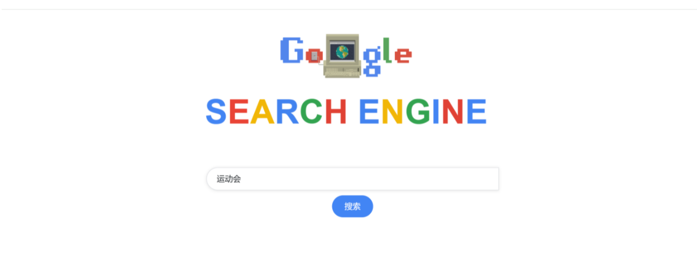
### （三）页面展示效果
各页面布局合理、功能明确，如主页面简洁美观，结果页面按评分排序展示并动态加载推荐内容。
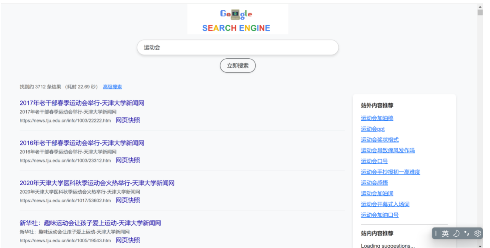
## 二、网页抓取
### （一）对象选取
选择南开要闻、媒体南开、天大新闻网作为爬取对象。这些网站内容丰富，涵盖校内及国内外新闻，且结构利于爬虫程序提取链接和信息。

### （二）代码实现
采用异步和协程方式，利用`asyncio`和`aiohttp`库提高爬虫效率。代码实现流程包括获取网页链接、处理重定向和超时、提取网页内容、存储和处理数据以及异常网页处理等步骤。

### （三）数据清洗与预处理
对抓取的网页数据进行删除无效网页、提取关键信息、更新CSV文件等处理，确保数据质量和结构化，便于后续操作。

## 三、构建索引
### （一）背景概述
为实现快速准确搜索，需对抓取的网页文本进行分词、构建倒排索引以及计算TF-IDF值。

### （二）分词
使用`jieba`的`cut_for_search`方法，遍历数据文件对标题、描述、正文字段分词，过滤标点符号和特殊符号后存储为字符串。

### （三）倒排索引构建
倒排索引实现从单词到相关文档的映射。构建步骤包括计算词频、构建正向索引，再基于正向索引构建倒排索引。

### （四）TF-IDF计算
计算每个词项的IDF，结合词频计算每篇文档的TF-IDF值，为文档相关性衡量提供依据。

## 四、PageRank链接分析
### （一）背景概述
PageRank算法用于衡量网页重要性和影响力，通过分析网页链接关系为网页分配分数，在搜索引擎中作为排序重要指标。

### （二）算法工作流程
包括构建有向图、初始权重设置、迭代计算（引入阻尼因子）和收敛判断。

### （三）数据准备
提取HTML文档中的链接标签，构建URL到其指向的URL列表的映射。

### （四）PageRank实现
使用`networkx.DiGraph`模块构建有向图，引入阻尼因子，利用`networkx.pagerank`完成迭代计算并处理结果。

### （五）结果分析
排名靠前的网页多为索引页或列表页，其链接数量多，通过双向交互提升PageRank值。在搜索结果排序中，结合TF-IDF、PageRank和相似度函数（如余弦相似度），采用线性加权法综合各项指标。

## 五、搜索功能
### （一）基础搜索
基于向量空间模型，通过分词与向量化、余弦相似度计算、排序与返回结果实现文档检索。
1. **分词与向量化**：
    - 利用`jieba.cut_for_search`对输入查询和文档内容分词。
    - 计算查询和文档的**TF-IDF**值。
2. **余弦相似度计算**：
基于词项的**TF-IDF**向量，计算查询向量与文档向量的余弦相似度，公式为：

$$
cosine_{similarity} = \frac{\sum_{i} q_{i} \cdot d_{i}}{\sqrt{\sum_{i} q_{i}^{2}} \cdot \sqrt{\sum_{i} d_{i}^{2}}}
$$

其中，$q_i$表示查询向量中第$i$个词项的TF-IDF值，$d_i$表示文档向量中第$i$个词项的TF-IDF值。
4. **排序与返回结果**：
将文档按相似度降序排列，返回前`num`个结果。 
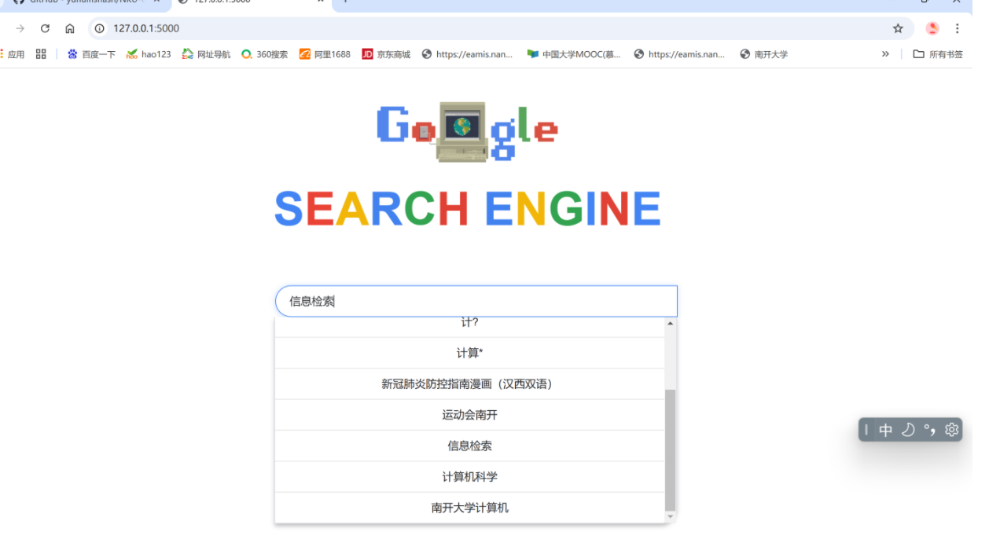

### （二）通配查询
支持正则表达式模糊匹配，通过正则模式检查、普通查询和正则过滤筛选文档。
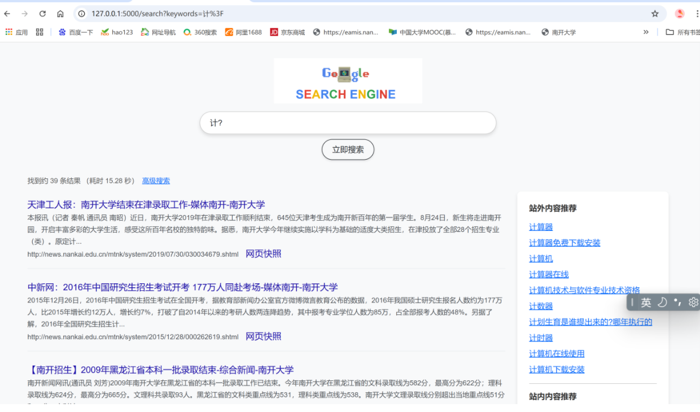

### （三）文档查询
实现文件类型过滤、完整URL处理、多文件解析和提取网页附件链接功能，支持关键字匹配文档标题查询。
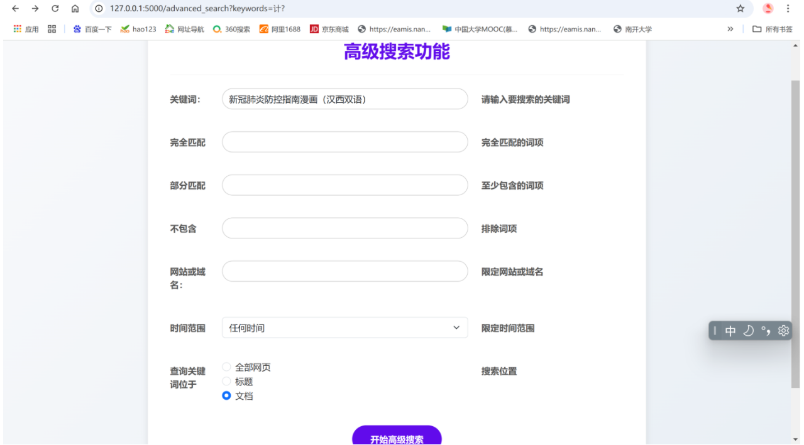
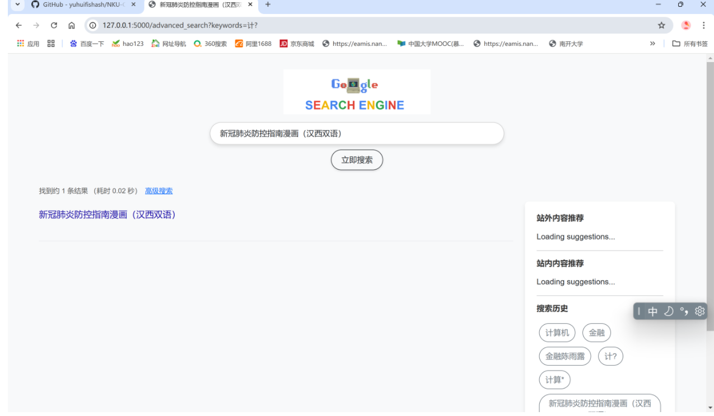

### （四）短语查询
实现完全匹配、部分匹配和不匹配三种模式，通过拆分短语、遍历文档筛选。

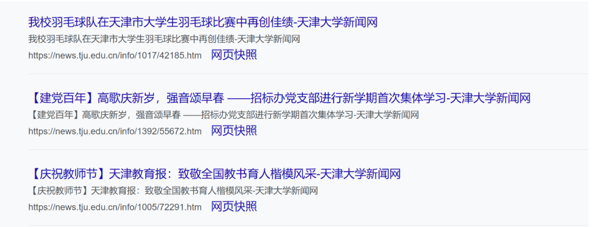

### （五）查询日志
分为用户搜索历史记录（通过cookie存储，支持个性化推荐）和系统日志记录（记录系统交互和事件，便于调试维护）。
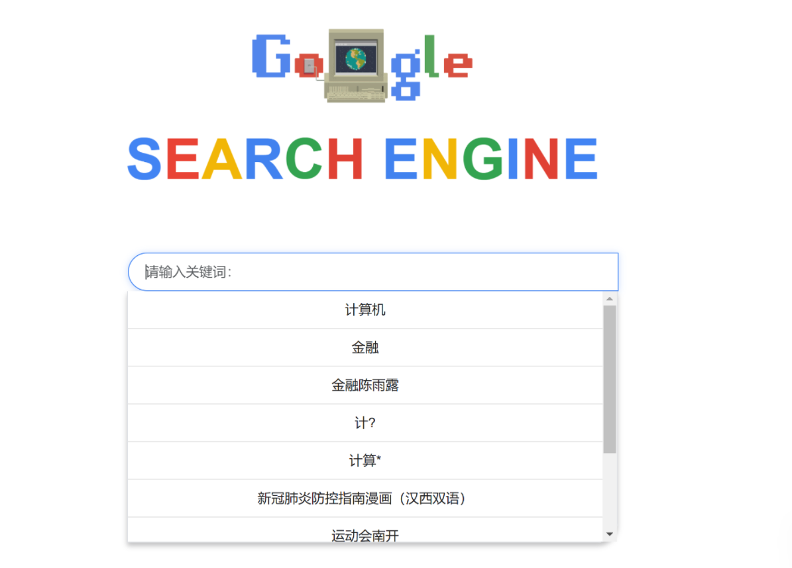
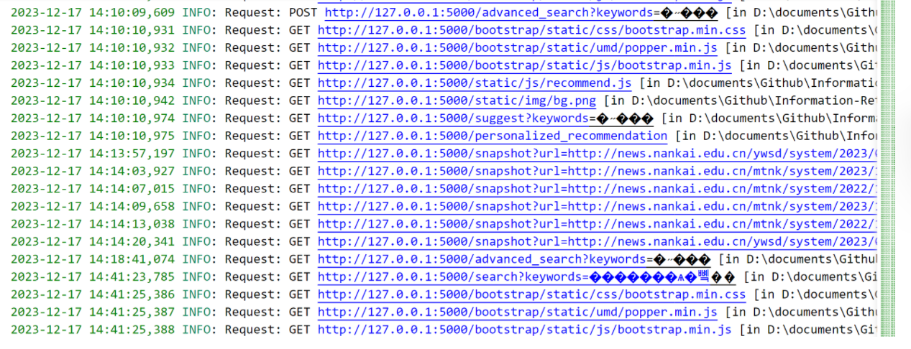

### （六）网页快照
提供网页历史版本查看，在爬取阶段保存HTML文件，后端提供路由渲染文件内容。
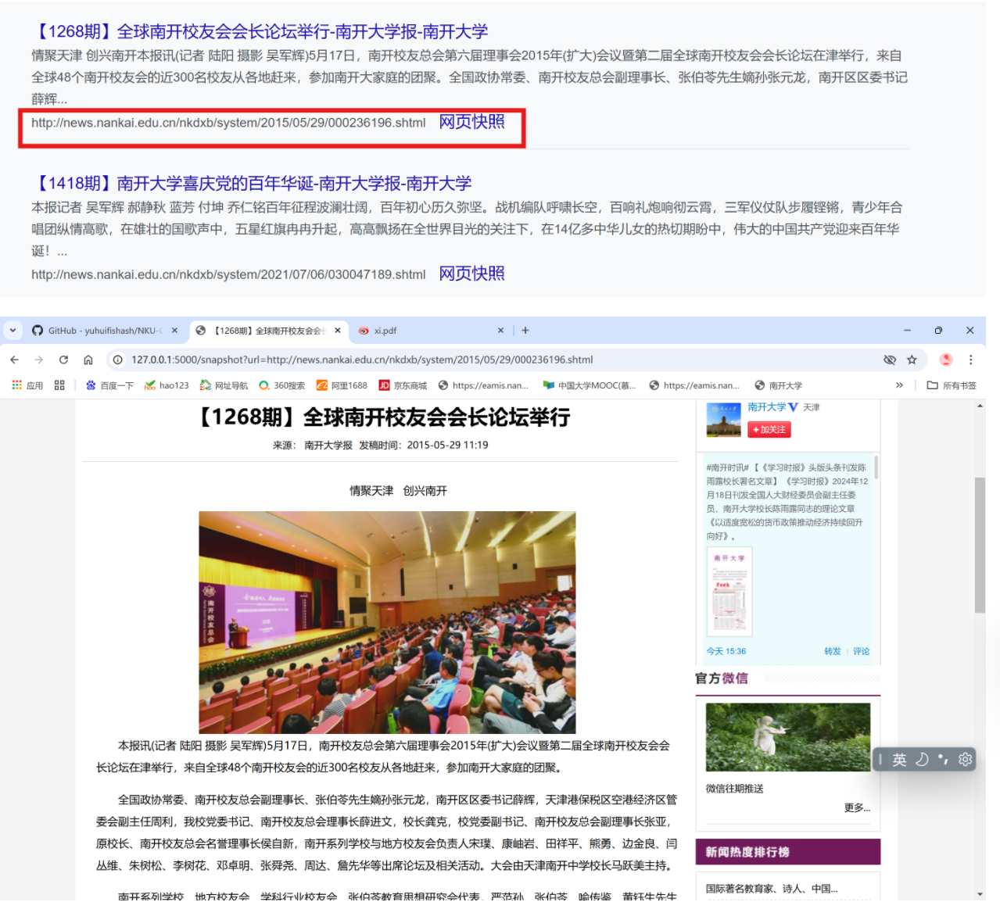

## 六、个性化查询
### （一）登录系统
Streamlit登录后将信息写入共享文件，Flask读取文件获取用户身份信息，两者松耦合运行。
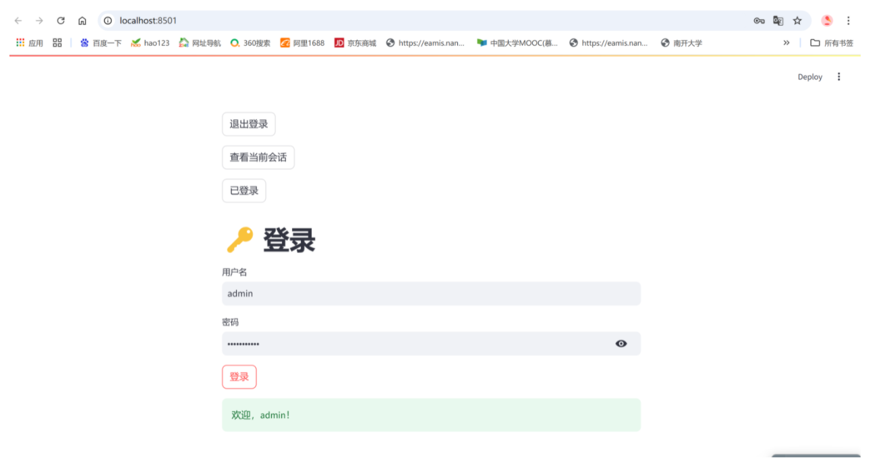

### （二）个性化查询
用户历史记录存储在前端cookie中，查询时引入历史行为权重，前端传递历史记录给后端，后端综合到排序算法中。
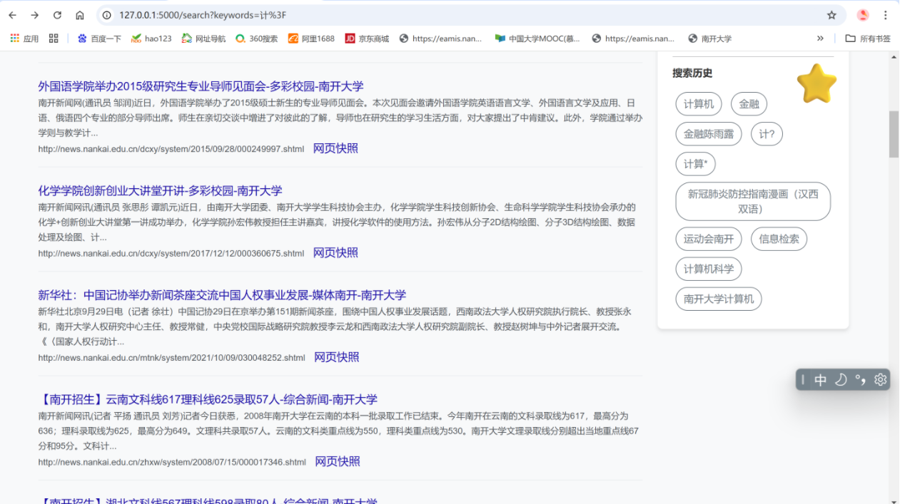

## 七、个性化推荐
### （一）功能概述
分为站外推荐（联网查询外部资源）和站内推荐（利用搜索历史推荐站内相关内容）。
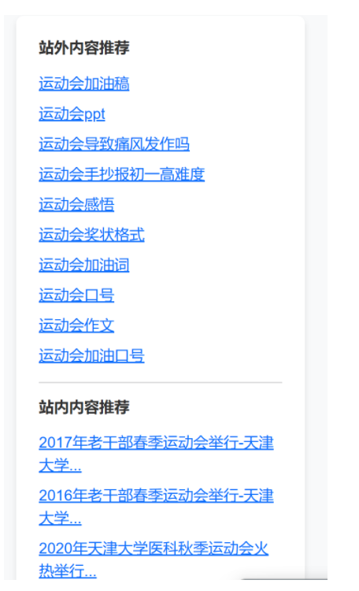

### （二）实现细节
后端读取搜索历史进行查询推荐，前端异步请求加载推荐数据并展示。 
